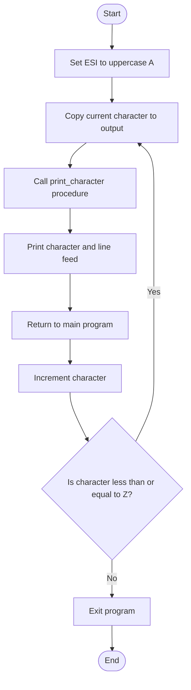

# Procedures Lab

## Objective

The objective of this activity is to learn how to create and call procedures in Assembly language. The program uses a procedure and a loop to generate the uppercase English letters from A through Z. Each character is displayed on a separate line.

## Program Description

The program begins by storing the ASCII value of uppercase `A` in the `ESI` register. A loop copies the current character into an output variable and calls the `print_character` procedure.

The procedure uses the Linux `sys_write` system call to print the character and a line-feed character. After the procedure returns, the program increments the character and repeats the loop until uppercase `Z` has been displayed.

## Assembly Code

```nasm
; Procedures Lab
; Generates uppercase English letters A through Z.
; Each letter is displayed on a separate line.
; Uses a loop and a procedure.

section .data
    output db 'A', 10       ; Character followed by line feed

section .text
    global _start

_start:
    mov esi, 'A'            ; Start with uppercase A

letter_loop:
    mov eax, esi
    mov byte [output], al   ; Store current character in output
    call print_character    ; Call procedure to display it

    inc esi                 ; Move to the next ASCII character
    cmp esi, 'Z'            ; Has Z been passed?
    jle letter_loop         ; Continue through Z

exit_program:
    mov eax, 1              ; sys_exit
    mov ebx, 0              ; Exit status 0
    int 0x80

print_character:
    push eax
    push ebx
    push ecx
    push edx

    mov eax, 4              ; sys_write
    mov ebx, 1              ; Standard output
    mov ecx, output         ; Address of output
    mov edx, 2              ; Character and line feed
    int 0x80

    pop edx
    pop ecx
    pop ebx
    pop eax
    ret
```

## Flowchart



## Thought Process

1. Store uppercase `A` as the first character.
2. Copy the current character into the output buffer.
3. Call a procedure to display the character and line feed.
4. Increment the ASCII value to obtain the next character.
5. Repeat the process until uppercase `Z` has been displayed.
6. Exit the program with a successful exit status.

## Challenges Encountered

One challenge was making sure that every character appeared on a separate line. I solved this by creating a two-byte output variable containing one character and one line-feed character.

Another challenge was preventing the Linux system call from changing register values needed by the main program. I used `push` instructions at the beginning of the procedure to save the registers and `pop` instructions before `ret` to restore them.

I also had to make sure that the loop included uppercase `Z`. Using `jle` allowed the loop to continue while the character was less than or equal to `Z`.

## Building and Running the Program

This program must be assembled and run on a Linux system with NASM installed.

### Assemble the program

```bash
nasm -f elf32 procedures.asm -o procedures.o
```

### Link the object file

```bash
ld -m elf_i386 procedures.o -o procedures
```

### Run the executable

```bash
./procedures
```

## Expected Output

```text
A
B
C
D
E
F
G
H
I
J
K
L
M
N
O
P
Q
R
S
T
U
V
W
X
Y
Z
```

## Conclusion

This activity demonstrates how procedures can divide an Assembly program into reusable sections. The loop prevents the same printing instructions from being repeated 26 times, while the procedure handles displaying each character and line feed.
